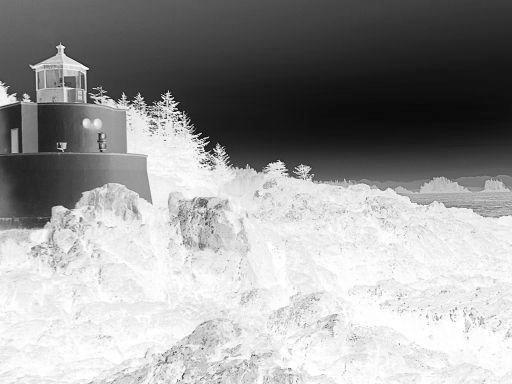
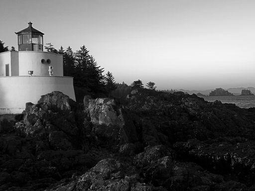
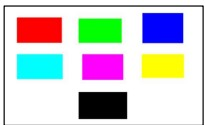
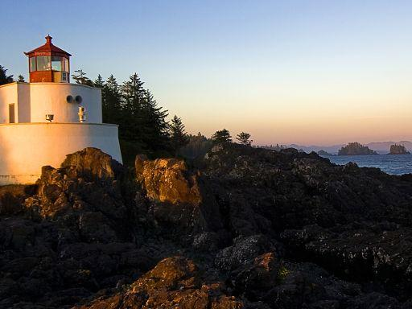

# Image Processing Application

This project is a Java-based desktop application for performing various image processing tasks. It provides a graphical user interface (GUI) to load, manipulate, and save images with different effects and transformations.

## Features

- **Open and Save Images**: Load images in various formats (BMP, JPG, PNG, GIF) and save them after processing.
- **Image Effects**:
  - Negative Effect
  - Grayscale Effect
  - Transparency Gradient
  - Color Segmentation
- **Image Transformations**:
  - Rotate Clockwise and Counter-Clockwise (90°)
  - Flip Vertically and Horizontally
- **Transparency with Two Images**: Blend two images with adjustable transparency.

## How to Run

1. Open the project in a Java IDE (e.g., NetBeans, IntelliJ IDEA, Eclipse).
2. Build the project using the provided `build.xml` file or your IDE's build tools.
3. Run the `NewJFrame` class to launch the application.

## Folder Structure

- **src/**: Contains the source code of the application.
  - `NewJFrame.java`: Main class for the GUI and image processing logic.
- **images/**: Sample images for testing the application.
- **build/**: Compiled classes and build artifacts.
- **nbproject/**: NetBeans project configuration files.

## Requirements

- Java Development Kit (JDK) 8 or higher
- A Java IDE or build tool (e.g., Apache Ant)

## Usage

1. Launch the application.
2. Use the "File" menu to open an image.
3. Apply effects or transformations using the "Image" menu.
4. Save the processed image using the "File" menu.

## Method Implementations

### `applyNegativeEffect`
This method iterates through each pixel of the image, inverts the RGB values, and updates the image with the negative effect. The inversion is calculated as:
```
Red = 255 - Red
Green = 255 - Green
Blue = 255 - Blue
```
This creates a photographic negative effect.

### `applyGrayscaleEffect`
This method converts each pixel of the image to grayscale by calculating the luminance using the formula:
```
Gray = 0.299 * Red + 0.587 * Green + 0.114 * Blue
```
The resulting grayscale value is applied to all three RGB channels, creating a monochrome image.

### `applyTransparencyEffect`
This method applies a transparency gradient to the image by adjusting the alpha channel of each pixel. The alpha value is calculated based on a slider input, where 0 represents full transparency and 100 represents full opacity. The transparency effect is applied as:
```
Alpha = (1.0 - sliderValue / 100) * 255
```

### `applyTransparencyEffectWithTwoImages`
This method blends two images of the same dimensions by adjusting the alpha value. The blending formula is:
```
R' = R1 * (1 - α) + R2 * α
G' = G1 * (1 - α) + G2 * α
B' = B1 * (1 - α) + B2 * α
```
Where `α` is the transparency level controlled by a slider. This creates a smooth transition between the two images.

### `applyColorSegmentation`
This method segments the image by isolating pixels close to a user-selected target color. The closeness is determined by a threshold value. Pixels within the threshold retain their original color, while others are set to black. The segmentation logic checks if:
```
|Red - TargetRed| <= Threshold
|Green - TargetGreen| <= Threshold
|Blue - TargetBlue| <= Threshold
```
If all conditions are met, the pixel is kept; otherwise, it is set to black.

### `rotateImage90Degrees`
This method rotates the image 90 degrees clockwise or counter-clockwise by rearranging the pixel positions. For clockwise rotation:
```
NewX = Height - OldY - 1
NewY = OldX
```
For counter-clockwise rotation:
```
NewX = OldY
NewY = Width - OldX - 1
```

### `flipImage`
This method flips the image horizontally, vertically, or both. For horizontal flipping:
```
NewX = Width - OldX - 1
NewY = OldY
```
For vertical flipping:
```
NewX = OldX
NewY = Height - OldY - 1
```

## Screenshots

### Main Interface


### Negative Effect


### Grayscale Effect


### Transparency Gradient


### Color Segmentation


### Blending Two Images


## License

This project is for educational purposes and does not include a specific license. Feel free to modify and use it as needed.
